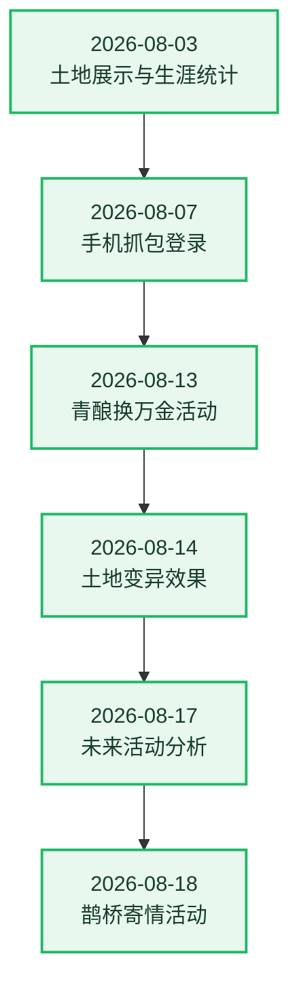

# 🌱 农场成长记录

[← 返回项目首页](../README.md)

这里记录 QQ Farm Bot 已完成的重要功能和改进。最新记录在最前面。

## 更新流水图

## 详细记录

### 2026-08-18 · 鹊桥寄情活动

- 支持自动使用、自动构建和自动指定好友赠送。
- 当前功能尚未完成全面测试。

### 2026-08-17 · 未来活动分析

- 活动页新增未来活动分析功能。
- 活动正式接入仍需要采集对应数据。

### 2026-08-14 · 土地变异效果

- “个人 → 我的农场 → 土地详情”新增作物变异效果展示，支持黄金、冰冻、爱心、暗化和湿润效果。
- 根据官方 `mutant_effect_plant` 配置映射变异作物，黄金变异可展示对应的金色植物贴图，并兼容多种变异组合。
- 暗化效果使用官方烟雾和粒子素材；其余效果结合对应作物显示金色辉光、冰晶、爱心和下落水滴动画。
- 所有变异动画限制在当前作物区域内，并调整作物锚点，使作物及特效更贴近菱形土地的视觉中心。
- 土地详情展示变异效果的实际作用，例如售价倍数、产量倍数或黄金果实产出。

### 2026-08-13 · 青酿换万金活动

- 新增活动页面。
- “自动控制 → 活动控制”中新增自动开关。

### 2026-08-07 · 手机抓包登录

- 内置纯 Node.js 抓包服务，默认嵌入 Bot 进程，无需单独启动服务或端口。
- 手机设置 Wi-Fi 代理后打开 QQ 农场，即可自动获取登录 Code 并添加账号。
- 支持多 IP 公布、局域网和 Tailscale 组网，面板可根据网络环境选择地址。
- 获取 Code 的同时解析好友 GID，并在后台同步 QQ 平台好友列表。
- 详细步骤见[抓包登录服务手册](../core/docs/capture-service.md)。

### 2026-08-03 · 土地展示重做

- 参考游戏内农场布局，实现等距视角土地展示。
- 完善普通作物各生长阶段图片。
- 完善四格作物展示，并使用官方资源生成对应图片。
- 新增土地资源图片更新指令。

### 2026-08-03 · 生涯统计与体验优化

- 点击头像即可查看生涯统计。
- 新增神秘商人自动购买开关。
- 修复每日任务进度展示错误。
- 修复种子获取策略问题。

### 2026-08-03 · 心许千灯星垂野活动

- 新增活动页面，可查看活动进度、星砂余额和奖励状态。
- 支持“观星礼录”奖励领取与“星砂兑换商店”奖励批量兑换。
- 支持领取“千星游记”阶段奖励和“节令小札”节令奖励。
- 新增“千星游记”和“观星礼录”自动领取选项，每 5 分钟检查一次。
- 补充活动作物、种子、装扮等奖励配置及活动专属图片资源。

### 2026-08-03 · TSDK/WASM 协议更新

- TSDK/WASM 升级至官方 `v3.8.6.1785240280`，适配新版运行时、数据段解密和完整性校验。
- 更新默认 WASM 文件及 SHA-256 校验，确保网关 Token、ACE 心跳和多账号运行正常。
- 新增 TSDK/WASM 更新检查工具，可比较版本、导入导出、数据段和关键运行参数。
- 补充标准更新、验证与回退流程。

### 2026-08-03 · 2×2 作物种植

- 修复活动四格作物“星语铃花”的占地配置，背包中增加 2×2 标识。
- 优化四格作物土地预留策略，优先选择已清空土地更多的区域。
- 收获后土地状态不明确时不再自动铲除，避免误铲仍在生长或进入下一季的四格作物。
- 补充土地展示、活动作物配置和 2×2 种植预留测试。
